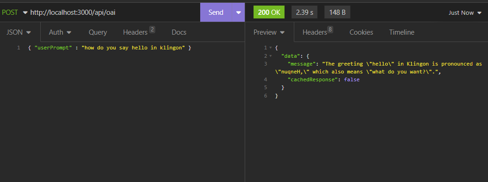

# OPEN AI Backend Development Server using NodeJS / Docker

## About This Project

This is a demo project for a local development server using OpenAI API's.

Frontend applications using OpenAI API's should NEVER directly use API keys in code due to the fact that JavaScript can be inspected using the Browser tools exposing sensitive information.

Instead, OpenAI APIs should be interacted with via a secure backend server that communicates with the frontend App via secure tokens that can easily be managed and revoked.

This demo project uses Docker containers running an Express JS Server within Node to contact OpenAI Servers with an API key provided via Environment variables and simple hard-coded JWT authorisation for demo purposes. A full AUTH flow would be need to be developed for production use.

In addition, to save unnecessary calls to the OpenAI API and reduce response times in development, REDIS has been used to cache questions and responses.

## Requirements

- Docker Desktop
- Node v18 +

## How to Use

Clone the project and start Docker.

### IMPORTANT: First copy the example.api.env to a file called api.env in the project root and insert a private OpenAPI key obtained from your account page on openai.com.

Run the following command to build the images, start the containers and start the server

```
npm run start
```

the server will serve from http://localhost:3000

to stop to containers run

```
npm stop
```

Changes made within the SRC folder will be reflected immediately in the container due to the bind mount.

If other changes are made (E.g to .env files) then you need to rebuild the images and restart containers with the command below:

```
npm run rebuild
```

## Using the API

### Endpoint Url

The api endpoint is show below:

```
http://localhost:3000/api/oai
```

### Headers

Make POST requests to this endpoint adding the following header key:value pair

```
x-access-token : <insert JWT here>
```


In this project, a hard coded JWT has been used for demo purposes using the TOKEN_KEY in the example.api.env file - the JWT value also is shown in the example.api.env.

In a real production project, Access Tokens would be generated dynamically of an AUTH flow for API access.

You can change the TOKEN_KEY in the api.env and generate new JWT Access Tokens manually using online JWT tools if required (E.g jwt.io).

### Payload and Response

The POST request should include a BODY with a JSON payload in the format:

```
{ "userPrompt" : "<insert Question String>"}
```

The response object is in the format :

```
{   data :
    {
        message: <response string>,
        cachedResponse : <boolean>
    }
}

```



### Cached Responses

In development, we often send the same request to the OpenAPI multiple times whilst settting up the frontend. To reduce the load on the OpenAPI endpoint and reduce response time (from several seconds to milliseconds - see the response time value in the images above and below), REDIS has been used to cache responses. When the same request is repeated, the response is taken from the REDIS Store.

If a response is returned from the REDIS cache the response object will have 'cachedResponse' set to TRUE. Otherwise this will be FALSE.


### REDIS password

The REDIS cache is password protected and the password is stored in the redis-password.secret file and injected into Docker as a secret. As this is just a local demo project, this file and password is purposely visible in the repo.

The password can be changed if required but the secrets filename should be changed (also updating the secrets filename in the REDIS service in the docker-compose file) and this file then omitted from version control if it is required to be kept secret in the future.

## useful commands

start server:

    npm start

stop server

    npm stop

rebuild docker images and containers

    npm run rebuild

nuke the project removing node modules, caches, docker images and container and rebuild and re-run

    npm run nuke

the log is stored in a newly created nuke-it.log file in the project root.
